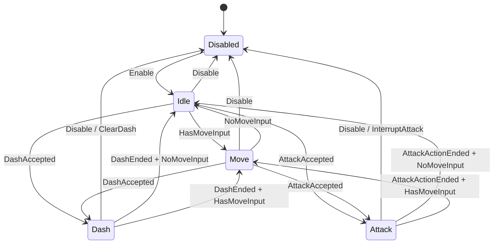

# Player 角色控制状态机重构计划

> 文档版本：v1.2<br>
> 日期：2026-09-06<br>
> 适用范围：当前 Player 控制闭环的等价重构<br>
> 关联文档：`ProjectStandards.md`、`PlayerGameplayStateArchitectureRefactorPlan.md`、`核心Gameplay模块技术文档.md`

## 0. 当前执行状态

| 步骤 | 状态 | 已完成内容 | 验证 |
| --- | --- | --- | --- |
| Step 0 | 已完成 | 固定旧 Dash 行为，补齐方向、持续时间、冷却、Buffer、阻挡、大 Delta 与重置回归；项目规范统一使用 `Config` 后缀 | 迁移前 Player EditMode `24/24` 通过 |
| Step 1 | 已完成 | 建立输入、输出、转移、Context、State 基类与集中式 FSM 内核；实现 Disabled、Idle | 运行时和测试程序集编译通过；Transition/Lifecycle 测试通过 |
| Step 2 | 已完成 | 实现 Idle/Move 同帧转移、完整速度输出、模拟量保留、对角限幅与非法输入保护 | Movement 测试通过 |
| Step 3 | 已完成 | Dash 方向、时序、冷却、Buffer 和阻挡行为迁入独立 State/Runtime | Dash 测试通过 |
| Step 4 | 已完成 | 基础攻击与旧 FSM 解耦；`BasicAttackDefinition` 保留 GUID 重命名为 `BasicAttackConfig` | Config 资产加载和 Combat 测试通过 |
| Step 5 | 已完成 | Attack 状态接入独立攻击 Driver，完成动作优先级、约束和结束闭环 | Attack 测试通过 |
| Step 6 | 已完成 | `PlayerController`、Facing、Motor 和动画 Presenter 改由新 FSM 单一输出驱动 | Unity 编译、EditMode 和 PlayMode 通过 |
| Step 7 | 已完成 | 删除旧状态机、旧约束类型及迁移完成的旧测试 | 删除后全仓运行时代码无旧类型引用 |
| Step 8 | 已完成 | 完成自动回归、Prefab/Scene 接线、可读性检查、文档同步和目标平台冒烟 | EditMode `53/53`、PlayMode `4/4`；Windows Development Build 成功并稳定启动 |

当前 `PlayerControlStateMachine` 已经是 `PlayerController` 唯一控制状态权威。旧 `PlayerActionStateMachine`、`PlayerActionState` 和 `PlayerActionConstraints` 已删除，不存在双状态机同时驱动 Player 的兼容路径。

## 1. 本次实现内容

本轮只重构当前 Player 控制闭环，在不改变现有玩法表现的前提下，将集中在一个大类中的状态逻辑拆成可阅读、可测试、可逐步扩展的 State Pattern。

本轮交付：

- `Disabled`：控制被禁用时的技术状态，负责安全清理和零输出。
- `Idle`：无移动输入时的站立状态。
- `Move`：有移动输入时的普通移动状态。
- `Attack`：当前基础攻击处于 Windup、Active 或 Recovery 时的控制状态。
- `Dash`：锁定进入方向、持续固定时间、可被侧面阻挡提前结束的冲刺状态。
- 每个状态使用独立普通 C# 类，明确实现 `Enter`、`Tick`、`Exit`。
- 所有状态切换经过 `PlayerControlStateMachine` 的唯一入口。
- 保留当前移动速度、攻击移动倍率、锁定朝向、Dash 冷却、Dash 输入缓存和撞墙结束行为。
- 保留 Dash 优先于 Attack 的同帧输入规则。
- 使用单一 `Tick` 输入和单一 `PlayerControlOutput` 输出，简化 `PlayerController.Update`。
- 将现有 `BasicAttackDefinition` 重命名为 `BasicAttackConfig`；后续项目自有 ScriptableObject 类型统一使用 `Config` 后缀。
- 补齐状态转移、Dash、Attack、禁用/重启和帧边界测试。

本轮不做：

- 不实现通用 Ability System。
- 不实现技能释放。
- 不实现 Alive/Dead 正交状态机。
- 不实现 Stun、Poison、Buff/Debuff 系统。
- 不实现网络同步、客户端预测或 Snapshot。
- 不实现 Boss/敌人 AI 状态机。
- 不引入 UnityHFSM 或其他第三方状态机依赖。
- 不制作可视化状态机编辑器。

这些后续系统只要求本轮留下清楚的替换边界，不提前编写无使用者的抽象。

## 2. 实现思路

### 2.1 本轮采用一个互斥 Player 控制状态机

本轮仍然只有一个 Player 控制 FSM；同一时刻只激活一个控制状态：



状态切换优先级固定为：

```text
Disable
> 当前 Attack/Dash 的完成或强制结束
> Dash 请求
> Attack 请求
> Idle/Move 切换
```

因此 Idle 和 Move 同帧同时收到 Dash、Attack 时，只会进入 Dash。若 Dash 因冷却不能立即执行，可以继续尝试 Attack；Attack 成功后清除尚未消费的 Dash Buffer，保持当前行为。

### 2.2 每个类型的唯一职责

`PlayerController`：

- 读取 `IPlayerInputSource`；
- 计算相机相对世界方向；
- 构造不可变的 `PlayerControlInput`；
- 每帧只调用一次状态机 `Tick`；
- 将 `PlayerControlOutput` 交给 Facing 和 Motor；
- 将 Motor 结果回报给状态机。

`PlayerControlStateMachine`：

- 创建并注册所有状态实例；
- 保存当前状态；
- 调用当前状态的 `Enter`、`Tick`、`Exit`；
- 校验合法转移；
- 限制单帧最大转移次数；
- 发布 `StateChanged`；
- 不读取 Input、Camera、Animator 或 `Time.deltaTime`。

`PlayerControlState`：

- 作为所有状态的抽象基类；
- 定义统一的 `Enter`、`Tick`、`Exit` 和移动结果回报接口；
- 提供默认无操作实现，避免每个状态复制无意义方法；
- 不保存共享的当前状态。

具体状态类：

- 只保存属于该状态的少量运行时数据；
- 根据输入和 Context 请求转移；
- 不直接给状态机的 CurrentState 赋值；
- 不直接读取 Unity Input、Camera 或 Animator。

`PlayerControlContext`：

- 保存状态共同需要的稳定依赖：`PlayerMovementConfig`、`PlayerBasicAttackDriver`；
- 保存本帧输入、累计安全时间和当前输出；
- 提供方向归一化等少量领域辅助操作；
- 不决定状态转移。

`PlayerBasicAttackDriver`：

- 隔离控制状态机与现有 `BasicAttackController`、`ICombatCommandGateway`；
- 负责创建攻击请求序号并提交基础攻击命令；
- 暴露攻击是否仍占用角色动作、锁定方向和移动倍率；
- 后续 Ability System 接入时替换这个 Driver，而不改 Idle、Move、Dash 状态。

`PlayerDashRuntime`：

- 保存 Dash 方向、结束时间、冷却结束时间和输入 Buffer 到期时间；
- 不修改当前状态；
- 使用绝对累计时间判断到期，避免大 `deltaTime` 丢失跨阶段剩余时间。

### 2.3 单一输入与输出

状态机输入：

```csharp
public readonly struct PlayerControlInput
{
    public Vector3 MoveDirection { get; }
    public Vector3 FacingDirection { get; }
    public bool IsDashPressed { get; }
    public bool IsAttackPressed { get; }
}
```

状态机输出：

```csharp
public readonly struct PlayerControlOutput
{
    public Vector3 HorizontalVelocity { get; }
    public bool CanTurn { get; }
    public bool HasLockedFacingDirection { get; }
    public Vector3 LockedFacingDirection { get; }
}
```

`PlayerController` 不再根据 `CurrentConstraints` 拼装速度和朝向。每个状态输出完整、可直接消费的本帧控制结果。

### 2.4 状态基类建议形状

下列代码只约束 API 形状，实际实现时按 `ProjectStandards.md` 补齐职责注释：

```csharp
public abstract class PlayerControlState
{
    public abstract PlayerControlStateId Id { get; }

    public abstract void Enter(
        PlayerControlContext _context,
        in PlayerControlTransition _transition);

    public abstract PlayerControlTransitionRequest Tick(
        PlayerControlContext _context,
        in PlayerControlInput _input,
        float _deltaTime);

    public abstract void Exit(
        PlayerControlContext _context,
        in PlayerControlTransition _transition);

    public virtual void ReportMovementResult(
        PlayerControlContext _context,
        in PlayerMovementResult _movementResult)
    {
    }
}
```

命名必须遵守项目规范：

- 私有字段：`mCurrentState`、`mDashRuntime`。
- 参数：`_context`、`_deltaTime`。
- 局部变量：`_transitionRequest`、`_horizontalVelocity`。
- 方法：`TryChangeState`、`ReportMovementResult`。
- bool：`IsEnabled`、`HasMoveInput`、`CanStartAttack`。
- 每个顶层类型和函数都编写具体职责 XML 注释。
- 一个文件一个顶层类型。

### 2.5 各状态行为

#### PlayerDisabledState

- Enter：中断攻击，清理 Dash Runtime、Buffer 和输出。
- Tick：持续输出零速度，不接受动作请求。
- Exit：不恢复旧状态；启用后始终进入 Idle。

#### PlayerIdleState

- Enter：清理普通移动输出。
- Tick：先消费可立即执行的 Dash，再尝试 Attack，最后根据移动输入进入 Move。
- Output：零水平速度；允许按当前朝向准备动作。
- Exit：没有额外副作用。

#### PlayerMoveState

- Enter：不缓存旧速度，速度始终由本帧输入计算。
- Tick：先消费 Dash，再尝试 Attack；无有效移动输入时进入 Idle。
- Output：归一化移动方向乘 `PlayerMovementConfig.MoveSpeed`；允许根据移动速度转向。
- Exit：清理普通移动输出。

#### PlayerAttackState

- 进入前：通过 `PlayerBasicAttackDriver.TryStartAttack` 成功提交攻击后才允许转移。
- Enter：清除 Dash Buffer，读取攻击锁定方向。
- Tick：攻击仍处于 Windup/Active/Recovery 时保持 Attack；动作阶段结束后根据移动输入进入 Idle 或 Move。
- Output：当前移动输入乘基础移动速度和 `BasicAttackConfig.MovementSpeedMultiplier`；朝向锁定为攻击方向。
- Exit：自然完成时保留攻击冷却；Disable/ForceReset 等中断原因才调用攻击重置。

#### PlayerDashState

- 进入前：Dash 配置有效、冷却结束且方向有效时才允许转移。
- Enter：锁定移动输入方向；无移动输入时使用当前 Facing；记录结束时间。
- Tick：忽略普通移动和 Attack；到达结束时间后根据当前移动输入进入 Idle 或 Move。
- Output：锁定方向乘 `PlayerMovementConfig.DashSpeed`；锁定朝向。
- ReportMovementResult：侧面碰撞且沿 Dash 方向的实际速度低于阈值时请求结束。
- Exit：启动冷却；清理当前 Dash 方向和持续时间，不清除冷却结束时间。

### 2.6 状态转移必须是唯一入口

状态类只返回 `PlayerControlTransitionRequest`。状态机统一执行：

```text
检查目标存在
-> 检查 From/To 合法
-> Previous.Exit
-> 写入 CurrentState
-> Current.Enter
-> 更新 CurrentStateId
-> 发布 StateChanged
```

`ForceReset` 也必须经过同一个内部切换函数，只允许跳过普通 Guard，不能跳过 Exit 清理。

### 2.7 本轮为后续系统留下的边界

- 后续技能不继续向这个 FSM 添加 `Fireball`、`Whirlwind` 等具体状态。
- 后续 Ability System 将替换 `PlayerBasicAttackDriver`，并决定是否保留一个泛化 `Action` 控制状态。
- 后续 Alive/Dead 作为独立生命周期状态域；死亡通过明确中断请求使本 FSM 进入 Disabled。
- 后续 Stun/Poison 不在本轮预实现；Stun 将通过控制锁/中断控制状态，Poison 不改变控制状态。
- 状态 ID、Transition Reason 和只读 StateChanged Event 保持值类型和稳定语义，便于后续网络 Bridge 观察。

## 3. 文件管理

### 3.1 新增运行时脚本

建议在第一份脚本创建时新增目录：

```text
Assets/ProjectRelay/Scripts/Runtime/Gameplay/Player/Control/
```

| 新增脚本 | 职责 |
|---|---|
| `PlayerControlStateId.cs` | 定义 Disabled、Idle、Move、Attack、Dash 稳定状态 ID。 |
| `PlayerControlTransitionReason.cs` | 定义 Enable、Disable、MoveStarted、MoveStopped、AttackStarted、AttackCompleted、DashStarted、DashCompleted、DashBlocked、ForceReset。 |
| `PlayerControlTransition.cs` | 保存 From、To、Reason 和方向等一次转移上下文。 |
| `PlayerControlTransitionRequest.cs` | 保存状态 Tick 返回的无副作用转移请求。 |
| `PlayerControlInput.cs` | 保存本帧移动、朝向、Dash 与 Attack 意图。 |
| `PlayerControlOutput.cs` | 保存最终水平速度和朝向策略。 |
| `PlayerMovementResult.cs` | 隔离状态机与 `CharacterController` 具体回报参数。 |
| `PlayerControlContext.cs` | 保存 Config、攻击 Driver、Dash Runtime、累计时间与当前输出。 |
| `PlayerDashRuntime.cs` | 保存 Dash 方向、持续时间、冷却和输入 Buffer。 |
| `PlayerBasicAttackDriver.cs` | 隔离控制 FSM、基础攻击执行器和命令 Gateway。 |
| `PlayerControlState.cs` | 定义所有控制状态统一的 Enter、Tick、Exit 契约。 |
| `PlayerDisabledState.cs` | 实现禁用状态。 |
| `PlayerIdleState.cs` | 实现站立和动作请求转移。 |
| `PlayerMoveState.cs` | 实现普通移动和动作请求转移。 |
| `PlayerAttackState.cs` | 实现基础攻击期间移动/朝向约束和完成转移。 |
| `PlayerDashState.cs` | 实现 Dash 进入、持续、阻挡、结束和冷却。 |
| `PlayerControlStateMachine.cs` | 注册状态、推进当前状态并集中执行转移。 |

### 3.2 新增测试脚本

```text
Assets/ProjectRelay/Scripts/Tests/EditMode/Player/Control/
```

| 新增脚本 | 职责 |
|---|---|
| `PlayerControlStateMachineTransitionTests.cs` | 验证完整合法转移图、非法转移、事件顺序。 |
| `PlayerControlStateMachineMovementTests.cs` | 验证 Idle/Move 输出和无一帧延迟切换。 |
| `PlayerControlStateMachineDashTests.cs` | 验证方向、持续、冷却、Buffer、阻挡和大 Delta。 |
| `PlayerControlStateMachineAttackTests.cs` | 验证攻击进入、移动倍率、朝向、完成和中断。 |
| `PlayerControlStateMachineLifecycleTests.cs` | 验证 Disable、Enable、ForceReset 和重复调用。 |
| `PlayerControlAssetWiringTests.cs` | 验证 Player Prefab 组件/Config 与 SampleScene Installer 引用。 |

### 3.3 修改的现有脚本

| 修改脚本 | 修改内容 |
|---|---|
| `PlayerController.cs` | 改为构造 Input、单次 Tick、消费 Output；移除手写 Dash/Attack 优先级和速度拼装。 |
| `PlayerAnimationPresenter.cs` | 读取新的 `PlayerControlStateId`；Idle/Move 可结合实际速度，Dash/Attack 使用权威控制状态。 |
| `BasicAttackController.cs` | 移除对旧 `PlayerActionStateMachine` 的反向依赖；只管理攻击阶段、命中和攻击冷却。 |
| `LocalCombatCommandGateway.cs` | 保持校验入口，改为与 `PlayerBasicAttackDriver` 配合，并更新 Config 命名。 |
| `BattleSandboxInstaller.cs` | 更新初始化签名和重命名后的 Config 类型。 |
| `BasicAttackControllerTests.cs` | 移除旧动作状态机装配，验证独立攻击运行时。 |
| `LocalCombatCommandGatewayTests.cs` | 使用新 Driver/FSM 边界验证攻击请求。 |
| `BasicAttackCombatPlayModeTests.cs` | 更新为新控制 FSM 的端到端断言。 |
| `PlayerActionStateMachineAttackTests.cs` | 迁移测试意图到新的 Attack/Lifecycle 测试后删除。 |
| `Docs/ProjectStandards.md` | 将 ScriptableObject 类型后缀规范从 Definition 更新为 Config。 |
| `Docs/核心Gameplay模块技术文档.md` | 每个完成步骤同步状态、数据流和验证结果。 |

### 3.4 重命名

| 原脚本 | 新脚本 | 要求 |
|---|---|---|
| `BasicAttackDefinition.cs` | `BasicAttackConfig.cs` | 类型同步改为 `BasicAttackConfig`；保留并移动原 `.meta`，不得生成新 GUID。 |

同时更新：

- `BasicAttackController.mDefinition` -> `mConfig`
- `BasicAttackController.Definition` -> `Config`
- 参数 `_definition` -> `_config`
- 测试字段 `mDefinition` -> `mConfig`
- Inspector Tooltip 和 XML 注释中的“定义” -> “配置”

现有 `BasicAttack_Default.asset` 文件名已经符合“类型_变体”的资源命名方向。脚本重命名后必须由 Unity Editor 打开并确认引用没有丢失；不得手写修改该资产 YAML。

### 3.5 完成迁移后删除

只有新状态机完成接线且测试通过后才删除：

- `PlayerActionState.cs` 与对应 `.meta`
- `PlayerActionStateMachine.cs` 与对应 `.meta`
- `PlayerActionConstraints.cs` 与对应 `.meta`
- 已完成等价迁移的旧测试脚本与对应 `.meta`

不得在新旧状态机同时驱动 Player 的过渡阶段删除旧代码。

## 4. 逐步执行计划

### Step 0：固定当前行为和命名决定

本步结果：

- 形成明确的等价行为表和状态转移表。
- 将 ScriptableObject 后缀统一为 `Config` 写入项目规范。
- 原则上不改玩法规则；回归测试若暴露与既定时序不一致的确定性 Bug，可先修复并写入验证记录。

修改文档：

- `Docs/ProjectStandards.md`
- `Docs/核心Gameplay模块技术文档.md`

新增/修改测试：

- 先为当前旧状态机补充缺失的 Dash 生命周期、冷却、Buffer、撞墙和大 Delta 回归测试。

实际修复记录：旧 `PlayerActionStateMachine` 在单个 Delta 同时跨过 Dash 剩余时间和冷却时会丢失溢出时间，导致冷却被额外延长；现已把溢出时间继续结算到冷却，并由回归测试固定。

Editor 配合：无。

进入下一步条件：

- Dash、Attack、Disable/Enable 的当前预期行为可以由自动测试描述。
- 已明确同帧输入规则为 Dash 优先。
- ProjectStandards 不再要求 ScriptableObject 使用 `Definition` 后缀。

### Step 1：建立新状态机的数据契约和空内核

本步结果：

- 新状态机可以注册状态、进入初始 Disabled、合法切换、执行 Enter/Exit 并发布事件。
- 尚不接入 PlayerController，也不删除旧状态机。

新增脚本：

- `PlayerControlStateId.cs`
- `PlayerControlTransitionReason.cs`
- `PlayerControlTransition.cs`
- `PlayerControlTransitionRequest.cs`
- `PlayerControlInput.cs`
- `PlayerControlOutput.cs`
- `PlayerMovementResult.cs`
- `PlayerControlContext.cs`
- `PlayerControlState.cs`
- `PlayerControlStateMachine.cs`
- `PlayerDisabledState.cs`
- `PlayerIdleState.cs`

新增测试：

- `PlayerControlStateMachineTransitionTests.cs`
- `PlayerControlStateMachineLifecycleTests.cs`

Editor 配合：无。

进入下一步条件：

- 所有状态写入只存在于状态机内部。
- `Exit -> CurrentState 写入 -> Enter -> StateChanged` 顺序有测试。
- 非法转移不改变状态。
- ForceReset 仍执行旧状态 Exit。
- 新旧代码同时存在时项目仍可编译。

### Step 2：实现 Idle 与 Move

本步结果：

- 新状态机能够根据世界空间移动输入在 Idle/Move 间切换。
- 每个状态产生完整 `PlayerControlOutput`。
- 暂时仍不驱动真实 Player。

新增脚本：

- `PlayerMoveState.cs`

修改脚本：

- `PlayerIdleState.cs`
- `PlayerControlStateMachine.cs`
- `PlayerControlContext.cs`

新增测试：

- `PlayerControlStateMachineMovementTests.cs`

Editor 配合：无。

进入下一步条件：

- 零输入稳定保持 Idle。
- 有效输入同帧进入 Move 并产生速度，不出现一帧零速度。
- 输入归零同帧进入 Idle。
- 斜向输入被限制为最大长度 1。
- NaN、Infinity 和负 Delta 不污染运行时状态。

### Step 3：迁移 Dash

本步结果：

- Dash 的全部行为进入 `PlayerDashState` 和 `PlayerDashRuntime`。
- 新状态机具备 Idle/Move/Dash 完整闭环。
- 冷却和 Buffer 不再散落在状态机主类。

新增脚本：

- `PlayerDashRuntime.cs`
- `PlayerDashState.cs`

修改脚本：

- `PlayerIdleState.cs`
- `PlayerMoveState.cs`
- `PlayerControlContext.cs`
- `PlayerControlStateMachine.cs`

新增测试：

- `PlayerControlStateMachineDashTests.cs`

Editor 配合：无。

进入下一步条件：

- Dash 从 Idle 和 Move 都可进入。
- 无移动输入时使用实际 Facing。
- Dash 期间输入不能改变方向。
- 结束后根据当前输入直接进入 Idle 或 Move。
- 撞墙可提前结束并启动完整冷却。
- 大 Delta 不延长实际冷却。
- Buffer 的创建、消费、过期和 Attack 清除规则有测试。

### Step 4：解耦基础攻击并完成 Config 重命名

本步结果：

- `BasicAttackController` 不再持有或调用旧 Player 状态机。
- 基础攻击可以独立推进阶段、命中和冷却。
- 所有相关 ScriptableObject 类型使用 `Config` 命名。

新增脚本：

- `PlayerBasicAttackDriver.cs`

重命名：

- `BasicAttackDefinition.cs/.meta` -> `BasicAttackConfig.cs/.meta`
- 类型 `BasicAttackDefinition` -> `BasicAttackConfig`

修改脚本：

- `BasicAttackController.cs`
- `LocalCombatCommandGateway.cs`
- `BattleSandboxInstaller.cs`
- 所有引用 `BasicAttackDefinition` 的测试脚本

测试：

- 更新 `BasicAttackControllerTests.cs`
- 更新 `LocalCombatCommandGatewayTests.cs`

Editor 配合：

- 在 Unity Editor 打开项目，让脚本重载和资源重新序列化完成。
- 检查 `BasicAttack_Default.asset` Inspector 正常显示且数据未丢失。
- 检查 Player Prefab/BattleSandbox 中 BasicAttack Config 引用仍存在。
- 保存受影响资产；不手写 YAML。

进入下一步条件：

- 基础攻击测试不需要创建旧 `PlayerActionStateMachine`。
- Windup/Active/Recovery/Cooldown 仍按原行为推进。
- 命中只在 Active 入口结算一次。
- Config 资源引用无 Missing Script、Missing Reference。

### Step 5：实现 Attack 状态

本步结果：

- 新 FSM 形成 Idle/Move/Attack/Dash 完整功能。
- Attack 只表达基础攻击占用角色控制的期间，不重复管理攻击阶段和命中。

新增脚本：

- `PlayerAttackState.cs`

修改脚本：

- `PlayerIdleState.cs`
- `PlayerMoveState.cs`
- `PlayerControlContext.cs`
- `PlayerControlStateMachine.cs`
- `PlayerBasicAttackDriver.cs`

新增测试：

- `PlayerControlStateMachineAttackTests.cs`

Editor 配合：无。

进入下一步条件：

- 只有 Driver 接受攻击请求后才进入 Attack。
- Dash 和 Attack 同帧时 Dash 优先。
- Dash 状态拒绝 Attack。
- Attack 状态拒绝并清除 Dash Buffer。
- 攻击期间应用 Config 的移动倍率并锁定朝向。
- Recovery 结束后根据当前输入直接进入 Idle 或 Move。
- 自然结束保留攻击冷却；Disable/ForceReset 能安全中断。

### Step 6：切换 PlayerController 到新状态机

本步结果：

- 实际 Player 只由新状态机驱动。
- `PlayerController.Update` 恢复为清楚的输入、状态机、Facing、Motor、MovementResult 五段流程。
- 旧状态机仍暂时保留但没有运行时调用者。

修改脚本：

- `PlayerController.cs`
- `PlayerAnimationPresenter.cs`
- `BasicAttackPresenter.cs`（仅在类型或事件签名变化时修改）
- `BattleSandboxInstaller.cs`
- `BasicAttackCombatPlayModeTests.cs`

目标 Update 数据流：

```text
Read Input
-> Build PlayerControlInput
-> PlayerControlStateMachine.Tick
-> Read PlayerControlOutput
-> Facing.Tick + Motor.TickMovement
-> PlayerControlStateMachine.ReportMovementResult
```

Editor 配合：

- 打开 Player Prefab 或 BattleSandbox 玩家对象。
- 检查所有序列化引用完整。
- 检查 Animator 参数仍能驱动 Idle、Move、Attack、Dash 表现。
- 手动验证移动、停止、攻击、冲刺、撞墙和控制禁用。

进入下一步条件：

- `rg` 搜索确认运行时代码不再实例化旧 `PlayerActionStateMachine`。
- Player 每帧只执行一次 Motor 位移。
- 新状态机每帧只有一个公开 Tick 入口。
- EditMode 与 PlayMode 测试通过。
- Unity Console 无新增 Error/Warning。

### Step 7：删除旧状态机和兼容代码

本步结果：

- 项目只有一套 Player 控制状态权威来源。
- 不保留“以后可能用到”的兼容 Tick 或旧 Constraint API。

删除脚本及对应 `.meta`：

- `PlayerActionState.cs`
- `PlayerActionStateMachine.cs`
- `PlayerActionConstraints.cs`
- 已迁移完成的旧状态机测试

修改脚本：

- 清理所有旧 using、属性和兼容分支。
- `Docs/核心Gameplay模块技术文档.md`

Editor 配合：

- 再次打开相关 Prefab 和 BattleSandbox，确认没有 Missing Script。

进入下一步条件：

- `rg` 搜索不存在旧类型引用。
- Unity 完整编译通过。
- 所有新状态测试与战斗 PlayMode 测试通过。

### Step 8：最终回归与可读性验收

本步结果：

- 当前闭环功能与重构前等价。
- 代码可以作为下一阶段 Alive/Dead 与 Ability System 的稳定基础。

修改内容：

- 只修复回归问题和同步最终文档，不在本步添加新功能。
- 更新 `Docs/核心Gameplay模块技术文档.md` 的完成度、数据流和验证记录。

Editor 配合：

- BattleSandbox 连续测试 10 次 Enable/Disable。
- 测试 Idle、Move、Attack、Dash 及相互拒绝。
- 测试 Dash 撞不同角度墙体。
- 测试攻击结束后立即移动、冷却结束后再次攻击。
- Windows Development Build 做最小冒烟测试。

完成条件：

- 本文第 5 节全部通过。
- 没有为了后续技能或死亡预先加入无使用者抽象。
- 每个状态类能够在一次阅读中说明自己的进入、保持、输出和退出规则。

## 5. 最终验收

### 功能

- [x] 启用控制后从 Disabled 进入 Idle。
- [x] Idle/Move 根据当前移动输入同帧切换。
- [x] Move 速度和相机相对方向与重构前一致。
- [x] Idle 和 Move 都能开始 Dash。
- [x] Dash 方向、持续时间、冷却、输入 Buffer 和撞墙结束与预期一致。
- [x] Idle 和 Move 都能开始基础攻击。
- [x] 攻击移动倍率、锁定朝向、阶段、命中和冷却与预期一致。
- [x] Dash 与 Attack 同帧请求时优先执行 Dash。
- [x] Attack、Dash 期间不接受互斥动作。
- [x] Attack/Dash 结束后根据当前输入直接进入 Idle 或 Move。
- [x] Disable、OnDisable、重复 Reset 不留下速度、方向、Buffer、攻击阶段或事件订阅。

### 结构

- [x] 状态切换只有 `PlayerControlStateMachine` 能执行。
- [x] 每个状态都有独立文件和具体职责注释。
- [x] `PlayerController` 不再包含状态转移条件链。
- [x] `BasicAttackController` 不再引用 Player 控制状态机。
- [x] `PlayerMotor` 仍是唯一移动执行者。
- [x] Animator/VFX 不修改 Gameplay 状态。
- [x] 没有旧新两套状态机同时工作。
- [x] 本轮涉及的 ScriptableObject 类型使用 `Config` 后缀。

### 编码规范

- [x] 私有字段使用 `mPascalCase`。
- [x] 参数和局部变量使用 `_camelCase`。
- [x] bool 使用 Is/Has/Can/Should 语义。
- [x] 方法使用 PascalCase。
- [x] 一个文件一个顶层类型。
- [x] 所有类型和函数具有具体职责 XML 注释。
- [x] Update 热路径无 LINQ、组件查找、字符串拼接和临时集合分配。

### 测试与 Editor

- [x] Transition、Movement、Dash、Attack、Lifecycle EditMode 测试通过。
- [x] Combat 与 SampleScene 初始化 PlayMode 测试通过。
- [x] `BasicAttack_Default.asset` 重命名类型后可由 Unity 加载且数据有效。
- [x] Player Prefab/BattleSandbox 的 Player 控制与战斗引用完整。
- [x] 批处理 Unity 编译与测试日志无新增脚本 Error。
- [x] Windows Development Build 冒烟测试通过。

Prefab/Scene 接线已通过 Unity Editor API 保存，并由永久 EditMode 资产测试验证。Windows Development Build 成功，生成的 Player 在隐藏批处理模式下稳定运行 6 秒且日志无初始化错误；验证后的临时构建目录已删除。

完成本计划后，再单独编写 Alive/Dead 正交状态与 Ability System 的下一阶段细则，不在本计划尾部直接继续扩展。
