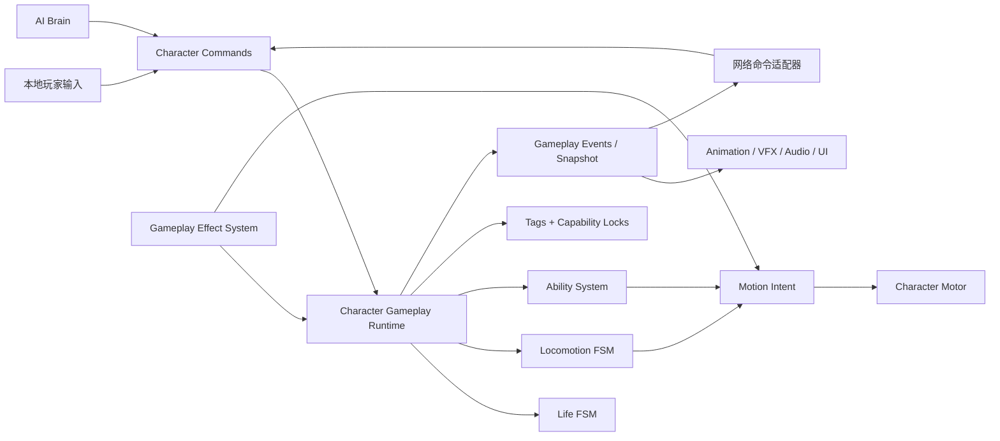

# 玩家 Gameplay 状态架构长期重构计划

> 适用目标：2 人联机、俯视角动作 Roguelike；预计包含多段攻击、主动技能、冲刺、击退、眩晕、中毒、Buff/Debuff、Boss 与普通敌人。
>
> 本计划以当前代码为迁移起点，但不把现有实现视为必须保留的架构约束。计划只描述重构目标、边界和落地顺序，不在本阶段修改运行时代码。

## 1. 结论与架构决策

不建议继续把所有 Gameplay 情况添加到单一 `PlayerActionState` 枚举，也不建议仅仅把当前 `switch` 机械地拆成 `FreeState`、`DashState`、`AttackState` 后就结束重构。

推荐的长期方案是：

1. 使用一个很薄、可测试、由项目自己拥有的状态机内核，只处理互斥状态的进入、更新、退出和合法转移。
2. 按互相独立的 Gameplay 维度拆分状态，而不是制造一个覆盖所有组合的角色总状态机。
3. 使用 Ability System 表达普攻、连击和技能执行；使用 Gameplay Effect 表达眩晕、中毒、减速和 Buff/Debuff。
4. 使用 Gameplay Tag 与带所有者的 Capability Lock 表达“什么正在生效”和“什么操作暂时被禁止”。
5. 从第一阶段就使用显式 Gameplay Tick、值类型 Command、稳定 ID 和可导入/导出的 Snapshot，为服务器权威同步、客户端预表现和未来可能的预测保留边界。
6. 玩家输入和敌人 AI 最终都生成同一种 Gameplay Command；Boss、小怪和玩家复用能力、效果、生命、移动执行模块，但不共用玩家输入控制器。

最终不是一个“万能状态机”，而是一组职责单一、能够组合的运行时系统：



## 2. 为什么不使用一个角色总状态枚举

FSM 适合表达“同一维度中严格互斥的模式”。例如角色同一时刻只能处于 `Alive` 或 `Dead`，移动执行同一时刻只能由 `Free`、`Dash` 或 `ForcedMotion` 中的一个拥有。

但以下概念不是同一个维度：

- 角色可以在中毒时移动、攻击或冲刺。
- 角色可以在攻击时按设计选择禁止移动、减速移动或允许正常移动。
- 角色可以在眩晕时仍然中毒。
- 角色可能被击退，同时带有减速和无敌效果。
- 技能有自己的前摇、生效、后摇、取消窗口和冷却；这些不应全部变成角色顶层状态。

如果把它们全部放入一个枚举，最终会出现类似 `AttackingWhilePoisoned`、`StunnedWhileDashing` 的组合状态。状态数量会随维度相乘，转移规则和清理逻辑也会迅速失控。

因此采用以下正交划分：

| 领域 | 建议模型 | 典型值 | 是否互斥 |
|---|---|---|---|
| 生命周期 | `LifeStateMachine` | `Alive`、`Dead` | 是 |
| 移动所有权 | `LocomotionStateMachine` | `Free`、`Dashing`、`ForcedMotion` | 是 |
| 技能执行 | `AbilitySystem` + 当前 `AbilityExecution` | `Idle` 或一个主要执行实例 | 主执行通道内互斥 |
| 状态效果 | `GameplayEffectSystem` | `Stun`、`Poison`、`Slow`、`Shield` | 否，可并存/叠层 |
| 操作权限 | `CapabilityLockSet` | 禁止移动、转向、冲刺、攻击、技能 | 否，按来源聚合 |
| 语义状态 | `GameplayTagContainer` | `State.Stunned`、`Ability.Melee` | 否，集合 |
| AI 决策 | `ActorBrain` | `Patrol`、`Chase`、`UseAbility` | 与角色执行分离 |

`Idle` 和 `Moving` 如果只影响动画，应从实际速度派生，不必成为 Gameplay 状态。只有当它们确实改变规则时才进入 FSM。

## 3. 对成熟方案的调研结论

### 3.1 Unity 官方 State Pattern

Unity 官方示例采用“状态接口/基类 + 每个状态一个类 + 非 `MonoBehaviour` 状态机 Context”的经典 State Pattern。这种写法适合解决当前单文件过长、进入/退出代码分散的问题，也是本计划状态机内核的基础。

它没有直接解决正交状态、技能冷却、持续效果和网络同步，因此只能作为底层构件，不能作为完整 Gameplay 架构。

参考：[Unity — Develop a modular, flexible codebase with the state programming pattern](https://learn.unity.com/course/design-patterns/tutorial/develop-a-modular-flexible-codebase-with-the-state-programming-pattern)

### 3.2 UnityHFSM

UnityHFSM 是成熟的 Unity 层级状态机实现，支持：

- 类状态和层级状态机；
- Trigger Transition 与 Any Transition；
- `StateChanged`；
- Exit Time 与延迟退出；
- 嵌套及并行状态；
- 初始化后状态更新/切换无 GC 分配的设计目标。

它很适合作为 Locomotion FSM、Boss 行为执行 FSM 或武器内部 FSM。它仍然不会自动提供 Ability、Effect、Tag、网络 Authority 或 Snapshot 语义。

本计划建议先借鉴其 API 和测试维度，不立即把核心 Gameplay 绑定到第三方包。阶段 1 做一个限时 Spike；只有当它能满足 Snapshot、固定 Tick、明确 Transition Reason、IL2CPP 和项目调试需求时，再决定是否固定版本引入。

参考：[UnityHFSM repository](https://github.com/Inspiaaa/UnityHFSM)、[UnityHFSM feature overview](https://github.com/Inspiaaa/UnityHFSM/wiki/Feature-Overview)

### 3.3 Stateless

Stateless 是成熟的 .NET 状态机库，支持层级状态、Trigger、Guard、外部状态存储和 introspection。它适合事件驱动的业务流程，也可用来参考“状态 + Trigger + 无副作用 Guard”的 API。

它不是围绕 Unity Gameplay Tick、动作时间轴、无分配热路径和联机快照设计的，因此不作为本项目首选运行时依赖。

参考：[Stateless repository and documentation](https://github.com/dotnet-state-machine/stateless)

### 3.4 Unreal Gameplay Ability System 的可借鉴部分

完整照搬 GAS 对当前项目过重，但它解决的问题与本项目高度一致：能力拥有者、能力激活、运行中实例、取消/阻止规则、Gameplay Tags、持续 Gameplay Effects、属性修改、表现 Cue 以及多人同步。

本计划借鉴这些概念，但实现一个更小的 Unity/C# 子集：

- `AbilityDefinition` 与 `AbilityExecution` 分离；
- Required / Blocked / Granted / Cancel Tags；
- 持续或周期性的 Gameplay Effects；
- 每次激活具有稳定的 `ActivationId`；
- Ability 自己负责正常结束或取消清理；
- 权威 Gameplay 与动画/VFX Cue 分离。

参考：[Epic — Understanding the Gameplay Ability System](https://dev.epicgames.com/documentation/en-us/unreal-engine/understanding-the-unreal-engine-gameplay-ability-system)、[Epic — Using Gameplay Abilities](https://dev.epicgames.com/documentation/en-us/unreal-engine/using-gameplay-abilities-in-unreal-engine)

### 3.5 网络同步相关结论

Unity Netcode 文档区分了持久状态和瞬时事件：需要让晚加入客户端获得的内容适合状态同步，瞬时通知适合 RPC。Netcode for GameObjects 提供的是 client anticipation，而不是完整的客户端预测与 rollback/replay。

因此 Gameplay 核心不能直接依赖 RPC、`NetworkVariable` 或 `NetworkBehaviour`。网络层应通过 Adapter 输入命令、输出快照和事件。即使最后采用其他网络方案，核心代码也无需重写。

参考：

- [Unity Multiplayer — Synchronizing states and events](https://docs-multiplayer.unity3d.com/netcode/2.3.2/advanced-topics/ways-synchronize/)
- [Unity Multiplayer — NetworkVariables](https://docs-multiplayer.unity3d.com/netcode/current/basics/networkvariable/)
- [Unity Multiplayer — Client anticipation](https://docs-multiplayer.unity3d.com/netcode/2.1.1/advanced-topics/client-anticipation/)
- [Unity Multiplayer — NetworkTime and ticks](https://docs-multiplayer.unity3d.com/netcode/1.13.0/advanced-topics/networktime-ticks/)

## 4. 目标代码结构

下面是目标结构，不要求一次创建完。目录按职责划分，避免再次形成大型 `PlayerActionStateMachine`。

```text
Assets/ProjectRelay/Scripts/Runtime/Gameplay/
├── StateMachines/
│   ├── IGameplayState.cs
│   ├── StateMachine.cs
│   ├── StateTransition.cs
│   ├── TransitionResult.cs
│   └── GameplayTick.cs
├── Characters/
│   ├── CharacterGameplayRuntime.cs
│   ├── CharacterRuntimeContext.cs
│   ├── CharacterCommand.cs
│   ├── CharacterCommandBuffer.cs
│   ├── CharacterStateSnapshot.cs
│   ├── Life/
│   │   ├── LifeStateId.cs
│   │   ├── AliveState.cs
│   │   └── DeadState.cs
│   └── Locomotion/
│       ├── LocomotionStateId.cs
│       ├── LocomotionStateMachine.cs
│       ├── FreeLocomotionState.cs
│       ├── DashLocomotionState.cs
│       ├── ForcedMotionState.cs
│       ├── MotionIntent.cs
│       └── DashRuntime.cs
├── Abilities/
│   ├── AbilitySystem.cs
│   ├── AbilityDefinition.cs
│   ├── AbilitySpec.cs
│   ├── AbilityExecution.cs
│   ├── AbilityActivationRequest.cs
│   ├── AbilityActivationResult.cs
│   ├── AbilityPhase.cs
│   ├── AbilityTimeline.cs
│   ├── AbilityId.cs
│   ├── AbilityActivationId.cs
│   ├── Tasks/
│   └── Targeting/
├── Effects/
│   ├── GameplayEffectSystem.cs
│   ├── GameplayEffectDefinition.cs
│   ├── ActiveGameplayEffect.cs
│   ├── EffectStackPolicy.cs
│   └── EffectId.cs
├── Tags/
│   ├── GameplayTag.cs
│   ├── GameplayTagSet.cs
│   └── GameplayTagQuery.cs
├── Capabilities/
│   ├── CharacterCapability.cs
│   ├── CapabilityLockSet.cs
│   └── CapabilityLease.cs
├── Events/
│   ├── GameplayEvent.cs
│   └── GameplayEventBuffer.cs
├── Presentation/
│   ├── CharacterAnimationPresenter.cs
│   └── GameplayCuePresenter.cs
└── Networking/
    ├── ICharacterCommandTransport.cs
    ├── ICharacterStateReplicator.cs
    └── CharacterNetworkAdapter.cs
```

玩家和敌人的差异应主要位于 Command 来源：

```text
LocalPlayerInputSource -> PlayerCommandSource ----┐
                                                  ├-> CharacterGameplayRuntime
EnemySensors -> EnemyBrain -> AICommandSource ----┘
```

## 5. 状态机内核设计

### 5.1 职责

状态机内核只负责：

- 保存当前状态；
- 在构造/初始化阶段注册状态实例；
- 校验并执行合法转移；
- 严格保证 `Exit -> 写入新状态 -> Enter -> 通知` 的顺序；
- 防止同一 Tick 无限转移；
- 输出结构化的接受/拒绝结果；
- 生成调试信息和 Snapshot 所需的稳定状态 ID。

它不负责：

- 读取 Unity Input；
- 直接读取 `Time.deltaTime`；
- 播放动画或 VFX；
- 发送 RPC；
- 查询伤害目标；
- 把所有角色系统塞进同一个 FSM。

### 5.2 状态对象约束

- 状态是普通 C# 对象，不是 `MonoBehaviour`，也不是运行时共享的 `ScriptableObject`。
- 每个状态实例在角色初始化时创建一次，之后复用，避免每次切换分配。
- 状态只通过显式 `Context` 访问依赖，不使用 Singleton 或 Service Locator。
- 状态的 `Enter`、`Tick`、`Exit` 应短小；复杂技能行为交给 Ability Execution/Task。
- Guard 必须无副作用；只有成功转移后才能修改运行时状态。
- 状态不能直接给 `CurrentState` 赋值，只能返回或请求一个 Transition。

建议 API 形状：

```csharp
public interface IGameplayState<TStateId, TContext>
    where TStateId : unmanaged, Enum
{
    TStateId Id { get; }

    void Enter(TContext context, in StateTransition<TStateId> transition);
    StateTickResult<TStateId> Tick(TContext context, in GameplayTick tick);
    void Exit(TContext context, in StateTransition<TStateId> transition);
}

public readonly struct GameplayTick
{
    public uint TickId { get; }
    public float DeltaSeconds { get; }
}

public readonly struct StateTransition<TStateId>
{
    public TStateId From { get; }
    public TStateId To { get; }
    public TransitionReason Reason { get; }
    public uint TickId { get; }
}
```

实际实现可以使用数组、泛型字典或显式字段，但 public API 必须保留以下特征：

- 唯一状态切换入口；
- 明确的 `TransitionReason`；
- `Try...` 返回 `TransitionResult`，而不是只返回无法诊断的 `bool`；
- `StateChanged` 只用于观察，不允许观察者反向修改核心状态；
- 同 Tick 转移次数有硬上限；
- 支持 `ExportSnapshot` / `ImportSnapshot`，恢复时不重复执行伤害等一次性副作用。

### 5.3 不立即实现完整通用 HFSM

第一版只实现项目当前需要的状态注册、Trigger、Guard、进入/退出和事件。不要一开始实现可视化编辑器、反射扫描、异步状态、任意层级并行等功能。

层级优先通过系统组合表达。只有实际出现大量父状态共有转移时，才增加一层 Parent State/HFSM 能力。例如 Boss 的 `Combat` 父状态下包含 `Approach`、`Cast` 和 `Recover`，它们共同继承 `Dead` 中断规则。

## 6. Locomotion 状态机

### 6.1 建议状态

```csharp
public enum LocomotionStateId : byte
{
    Free = 0,
    Dashing = 1,
    ForcedMotion = 2
}
```

含义：

- `Free`：普通输入可以生成移动意图。
- `Dashing`：Dash Runtime 独占水平运动，使用进入时确定的方向和剩余 Tick。
- `ForcedMotion`：击退、拉拽或冲击波等外力独占移动；具体参数由 `ForcedMotionRuntime` 提供。

`Disabled` 不再作为 Locomotion 状态。控制关闭、死亡、眩晕通过 Life State 和 Capability Lock 阻止输入；Motor 是否仍需处理重力/外力由明确规则决定。

`Idle` 与 `Moving` 默认从 `MotionIntent` 或实际速度派生，只供表现层使用。

### 6.2 输出 MotionIntent，而不是直接移动

Locomotion 状态不直接调用 `CharacterController.Move`，而是输出：

```csharp
public readonly struct MotionIntent
{
    public Vector3 DesiredHorizontalVelocity { get; }
    public bool HasLockedFacing { get; }
    public Vector3 LockedFacing { get; }
    public MotionPriority Priority { get; }
}
```

`CharacterMotor` 仍是唯一移动执行者。Ability 或 Effect 可以提交带来源和优先级的 Motion Modifier，但最终合并规则只有一个位置。

### 6.3 Dash 运行时

Dash 的方向、开始 Tick、结束 Tick、冷却结束 Tick和 `ActivationId` 属于 `DashRuntime`。输入缓存属于 `CharacterCommandBuffer` 或 Ability Input Buffer，不再由 Locomotion FSM 保存。

时间优先使用 Tick 边界：

```text
StartTick = 120
EndTick = 126
CooldownEndTick = 150
```

这样可以避免当前大 `deltaTime` 跨过 Dash 结束点却丢失剩余时间的问题，也更容易网络同步和测试。

## 7. Ability System

### 7.1 普攻和主动技能使用同一条激活管线

不要为每个技能向角色状态枚举添加 `FireballCasting`、`WhirlwindAttacking`。每个技能是一个 `AbilitySpec`，激活后创建一个 `AbilityExecution`：

```text
AbilityDefinition：只读设计数据，ScriptableObject
AbilitySpec：角色当前拥有的能力、等级、充能和冷却
AbilityExecution：某一次激活的运行时数据
AbilitySystem：验证请求、管理执行实例、取消和结束
```

建议基本阶段：

```csharp
public enum AbilityPhase : byte
{
    None = 0,
    Windup = 1,
    Active = 2,
    Recovery = 3
}
```

Cooldown 不应是“正在执行的动作阶段”。它属于 `AbilitySpec` 的再次激活条件。这样释放完动作锁后，角色可以移动或使用其他技能，而该技能仍在独立冷却。

### 7.2 激活流程

统一入口：

```csharp
AbilityActivationResult TryActivate(in AbilityActivationRequest request);
```

顺序必须固定：

1. 检查 Authority 与命令 Sequence/Tick。
2. 检查 Ability 是否已授予。
3. 检查 Required / Blocked Tags。
4. 检查 Capability、冷却、充能和资源。
5. 检查当前执行能否被新 Ability 取消。
6. 分配非零 `AbilityActivationId`。
7. 获取本次执行需要的 Capability Lease。
8. 扣除资源并启动冷却；具体时点由 Definition 明确配置。
9. 创建并进入 `AbilityExecution`。
10. 发布值类型 Gameplay Event，表现层据此播放动画/VFX。

拒绝结果必须包含稳定原因，例如：

```text
NotGranted
BlockedByTag
CapabilityLocked
OnCooldown
InsufficientResource
InvalidTarget
InvalidDirection
AlreadyExecuting
NotAuthoritative
StaleCommand
```

### 7.3 多段攻击

多段攻击应是一个 Combo Ability 的执行数据，而不是三个角色顶层状态：

```text
ComboAbilityDefinition
└── Steps[]
    ├── Step 0: Windup / Active / Recovery / ComboOpenWindow
    ├── Step 1: Windup / Active / Recovery / ComboOpenWindow
    └── Step 2: Windup / Active / Recovery
```

运行时至少保存：

- `ActivationId`
- `AbilityId`
- `CurrentStepIndex`
- `CurrentPhase`
- `PhaseStartTick` / `PhaseEndTick`
- `HasBufferedNextStep`
- 锁定朝向或瞄准数据
- 本段已经命中的目标集合或命中序号

输入规则：

1. 普攻输入到达时，若没有执行 Combo，则尝试激活 Step 0。
2. 若处于允许缓存的窗口，设置 `HasBufferedNextStep`。
3. 到达 Commit Point 时，如果已经缓存且下一段存在，则进入下一 Step。
4. 超过窗口、被硬控、目标规则失败或玩家主动取消时，统一走 `Cancel(reason)`。
5. `End` 和 `Cancel` 都必须释放本次 `ActivationId` 持有的锁和临时 Tag。

动画只能消费阶段与 Step 信息，不能由 Animation Event 决定权威命中、阶段完成或 Combo 是否成立。动画事件可以用于非权威音效/VFX提示。

### 7.4 特殊技能扩展

常规技能优先由数据驱动的 Timeline + 可复用 Task 组合：

```text
WaitTicks
AcquireTarget
SpawnHitQuery
ApplyEffect
SpawnProjectile
ApplyImpulse
CommitCost
OpenInputWindow
EmitGameplayCue
```

只有行为无法由这些构件清楚表达时，才增加专用 `IAbilityLogic`。避免每个技能复制一套完整状态机，也避免制作一个包含大量 `switch (AbilityId)` 的总控制器。

## 8. Gameplay Tags 与 Capability Locks

### 8.1 Tags 表达语义，不直接保存所有逻辑

示例 Tag：

```text
State.Alive
State.Dead
State.Stunned
State.Invulnerable
Locomotion.Dashing
Ability.Executing
Ability.Melee
Ability.Skill.Movement
Effect.Poison
Effect.Slow
```

Ability Definition 可以声明：

```text
RequiredOwnerTags
BlockedOwnerTags
GrantedOwnerTags
CancelAbilitiesWithTags
BlockAbilitiesWithTags
```

运行时不要依赖任意字符串比较。Tag 需要稳定注册表和数值 ID；编辑器可以显示层级名称，Snapshot 和网络消息只保存稳定 ID/紧凑集合。

### 8.2 带所有者的 Capability Lease

建议能力集合：

```csharp
[Flags]
public enum CharacterCapability : ushort
{
    None = 0,
    Move = 1 << 0,
    Turn = 1 << 1,
    Dash = 1 << 2,
    PrimaryAttack = 1 << 3,
    Skill = 1 << 4,
    Interact = 1 << 5
}
```

任何 Ability 或 Effect 若要禁止操作，应获取一个 Lease：

```csharp
CapabilityLease AcquireLocks(
    GameplaySourceId owner,
    CharacterCapability blockedCapabilities);
```

Lease 保存来源。只有所有者结束/取消或系统执行强制清理时才能释放。多个来源同时禁止移动时，释放其中一个不会错误恢复移动能力。

这比全局 `CanMove = false/true` 更安全，也解决当前任意攻击控制器都能调用 `InterruptAttacking()` 释放动作锁的问题。

所有 Lease 必须满足：

- 可重复释放而不出错；
- 角色死亡/Despawn 时集中清理；
- Debug View 能列出每个被阻止能力及其来源；
- Snapshot 恢复后能够重建；
- 禁止依赖 C# finalizer 或 Unity 对象销毁自动释放。

## 9. Gameplay Effect System

眩晕、中毒、减速不应成为同一状态机中的互斥状态，而应是可并存、可叠层、可过期的 Active Effects。

`GameplayEffectDefinition` 至少包含：

- `EffectId`
- Duration Policy：Instant / Duration / Infinite
- Duration / Period（以 Tick 表达）
- Stacking Policy：不叠加、刷新时间、叠层、独立实例
- 最大层数
- Granted Tags
- Blocked Capabilities
- Attribute Modifiers
- 周期执行逻辑
- 应用、周期、移除时的 Gameplay Cue ID

### 9.1 眩晕

眩晕的建议处理顺序：

1. 权威端应用 `StunEffect`。
2. Effect 授予 `State.Stunned`。
3. Effect 获取 Move / Turn / Dash / PrimaryAttack / Skill Locks。
4. Ability System 按规则取消可被硬控打断的当前 Ability。
5. 若有击退，同时向 Locomotion FSM 提交 `ForcedMotion`，不要把击退速度藏在 Stun Effect 中。
6. Effect 到期后移除自己的 Tag 和 Lease；如果还有另一个 Stun，角色仍然保持受限。

### 9.2 中毒

中毒只需要持续 Effect：

1. 保存来源、层数、到期 Tick 和下一次周期 Tick。
2. 每个周期在服务器产生 Damage Request。
3. 根据规则刷新、叠层或建立独立实例。
4. 不占用 Locomotion 或 Ability 状态。
5. 客户端依据持续状态和 Cue 播放图标/VFX，不自行决定伤害。

## 10. Character Gameplay Runtime 的固定更新顺序

所有核心规则使用一个明确的模拟入口，不再由多个 `MonoBehaviour.Update` 的隐式先后关系决定：

```csharp
void Simulate(in GameplayTick tick, in CharacterCommandBatch commands);
```

每个 Tick 的建议顺序：

1. 接收并验证本 Tick 的外部命令与服务器事件。
2. 应用新 Effect、伤害、死亡等权威结果。
3. 推进 Effect 周期与到期。
4. 处理 Death、Stun 等高优先级中断。
5. 推进当前 Ability Execution。
6. 按明确优先级处理新的 Ability/Dash/Interact 请求。
7. 推进 Locomotion FSM。
8. 聚合 Motion Intent 与 Modifier。
9. 由 Motor 执行一次移动。
10. 处理碰撞反馈，并将需要的转移排到当前 Tick 尾部或下一 Tick。
11. 生成 Snapshot 和 Gameplay Events。

建议默认请求优先级：

```text
Death
> Server Correction / Despawn
> Hard Crowd Control
> Forced Motion
> Explicit Ability Cancel
> Ability Phase Progress
> Dash
> Skill
> Primary Attack
> Normal Movement
```

优先级必须集中定义并测试。个别技能需要例外时，用 Definition/Policy 明确覆盖，不依赖代码调用顺序。

## 11. 网络就绪设计

当前项目包配置尚未绑定具体 Gameplay Netcode 实现，因此本阶段只建立传输无关的边界。

### 11.1 Command

客户端或 AI 只提交值类型意图：

```csharp
public readonly struct CharacterCommand
{
    public uint ClientTick { get; }
    public uint Sequence { get; }
    public CharacterCommandType Type { get; }
    public AbilityId AbilityId { get; }
    public Vector2 Move { get; }
    public Vector3 AimDirection { get; }
}
```

不要通过网络请求“设置状态为 Attacking”。客户端请求的是“尝试激活 Ability X”，服务器根据自己的 Tags、Effect、冷却、位置和资源验证。

### 11.2 Snapshot

持久状态使用可序列化快照：

```csharp
public struct CharacterStateSnapshot
{
    public uint ServerTick;
    public LifeStateId LifeState;
    public LocomotionStateId LocomotionState;
    public AbilityId ActiveAbilityId;
    public AbilityActivationId ActivationId;
    public AbilityPhase AbilityPhase;
    public byte ComboStep;
    public uint PhaseEndTick;
    public Vector3 Position;
    public Vector3 Facing;
    public Vector3 ForcedMotionVelocity;
}
```

完整 Active Effects 可以通过紧凑列表或增量复制；不要把对象引用、状态类实例、Delegate 或协程状态放入 Snapshot。

### 11.3 Authority 建议

- 服务器：技能是否合法、冷却/资源、命中、伤害、Effect、死亡、掉落。
- Owner Client：立刻播放输入反馈，可预表现移动、转向、Dash 和技能前摇。
- Remote Client：消费服务器状态并插值表现。
- 服务器拒绝后：Owner Client 能够根据 Command Sequence / ActivationId 取消预表现并校正。

第一版联机不承诺完整 rollback。先做到服务器权威 + Owner anticipation + 状态校正。若实测延迟无法接受，再基于已有 Command、Tick、Snapshot 增加输入历史和重放。

### 11.4 不追求 Unity 物理的跨机器完全确定性

`CharacterController`、碰撞查询和浮点物理不应假设在不同机器上逐 Tick 完全一致。服务器保留最终权威。客户端预测用于响应速度，碰撞和伤害结果可以被服务器纠正。

## 12. Boss 与小怪如何复用

玩家和 AI 共享：

- `CharacterGameplayRuntime`
- Locomotion FSM
- Ability System
- Gameplay Effect System
- Tags / Capability Locks
- Health / Attributes
- Damage / Hit 结算
- Snapshot / Gameplay Events

不共享：

- 本地输入读取
- Camera 相对方向计算
- AI 感知和决策
- 玩家 UI

AI Brain 的状态表示“决策意图”，而角色 Gameplay 状态表示“执行事实”。例如 Boss Brain 可以有：

```text
Dormant -> SelectPattern -> Approach -> ExecutePattern -> Reposition
```

`ExecutePattern` 不直接修改玩家状态机或播放伤害，而是向同一个 Ability System 提交 Ability Command。这样 AI 不会绕过冷却、眩晕和服务器校验规则。

复杂 Boss 可使用 HFSM 或行为树进行高层决策；不要把整套 Boss 决策塞进通用角色 Locomotion FSM。

## 13. 表现层边界

Animator、VFX、Audio 和 UI 都是只读观察者：

- 通过 Snapshot 读取持续状态；
- 通过 Gameplay Event/Cue 响应一次性事件；
- 可以报告纯表现完成，但不能成为权威 Gameplay 计时器；
- 不直接调用 `CurrentState = ...`、应用伤害或释放 Capability Lease；
- 动画 Cross Fade 时间不能决定命中窗口。

建议事件示例：

```text
StateTransitioned
AbilityStarted
AbilityPhaseChanged
AbilityCancelled
HitConfirmed
EffectApplied
EffectStackChanged
EffectRemoved
GameplayCueStarted / Stopped
```

事件使用不可变值类型，包含 Tick、Source、Target、AbilityId、ActivationId 等必要关联字段。

## 14. 分阶段迁移计划

### Phase 0：冻结现有行为并建立安全网

目标：重构前先让当前行为可验证。

任务：

- 为现有 Dash 补齐持续时间、冷却、输入缓存、撞墙、大 `deltaTime` 和 Reset 测试。
- 为 Dash 与 Attack 同 Tick 输入建立明确优先级测试。
- 为攻击完成、打断、禁用/启用和零时长阶段建立集成测试。
- 修复 Dash 大 `deltaTime` 丢失剩余时间的问题。
- 记录当前可观察行为作为迁移基线，不锁定不合理的内部实现。

验收：

- 旧实现的关键行为有自动测试覆盖。
- 不依赖场景手动操作才能验证状态转移。
- 测试能稳定复现帧率边界。

### Phase 1：建立最小状态机内核与网络友好基础类型

目标：先验证新的代码阅读体验和运行时约束。

任务：

- 实现 `GameplayTick`、`StateTransition`、`TransitionResult`、`IGameplayState` 和薄状态机。
- 增加统一 `TryTransition`、Transition Reason、事件和同 Tick 转移上限。
- 增加 Debug Description/当前状态路径。
- 增加 Snapshot 导入/导出测试。
- 用一个独立 Spike 比较自有内核与固定版本 UnityHFSM；不在 Spike 完成前添加生产依赖。

验收：

- 每次状态切换只有一个写入入口。
- Enter/Exit 顺序有测试。
- 非法转移不产生副作用。
- 连续运行热路径无每 Tick/每切换托管分配。
- IL2CPP 可编译。

### Phase 2：迁移 Locomotion

目标：从当前 `PlayerActionStateMachine` 中取出 Free、Dash 和移动输出。

任务：

- 建立 `LocomotionStateMachine`。
- 实现 `FreeLocomotionState`、`DashLocomotionState`、`ForcedMotionState`。
- 引入 `MotionIntent`，让 Motor 仍保持唯一移动执行点。
- 把输入缓存移到 Command Buffer。
- 删除或弃用旧的兼容 `Tick()` 多入口 API。
- 暂时通过 Adapter 保持 `PlayerController` 外部行为一致。

验收：

- `PlayerController.Update` 不再手动编排 Dash 与状态机内部时间。
- Dash 状态类只包含 Dash 相关字段和规则。
- 添加 `ForcedMotion` 不需要修改 Dash 状态。
- 旧移动/冲刺测试全部通过。

### Phase 3：建立 Ability、Tag 和 Capability Lease，迁移普攻

目标：把 `Attacking` 从 Locomotion/角色总状态中移除。

任务：

- 实现最小 `GameplayTagSet` 和 `CapabilityLockSet`。
- 实现 `AbilityDefinition`、`AbilitySpec`、`AbilityExecution`、激活结果。
- 将 `BasicAttackController` 迁移成第一个 Ability。
- 将 Windup/Active/Recovery 与 Cooldown 分离。
- 用 `ActivationId` 持有和释放动作锁。
- 保留当前 Gateway 作为 Command/Authority Adapter，移除其对具体 BasicAttackController 的硬耦合。

验收：

- Ability 冷却期间，最终 `CanActivate` 查询不会返回错误的可用状态。
- 正常结束、取消、死亡、Disable、Despawn 均不会泄漏 Lock/Tag。
- 角色状态中不再存在泛化的 `Attacking`。
- 命中仍只由权威 Gameplay 逻辑触发一次。

### Phase 4：实现多段攻击

目标：验证架构可以增加复杂动作而不修改角色总状态机。

任务：

- 添加 Combo Definition、Step Runtime、Input Window 和 Commit Point。
- 添加下一段输入缓存与超时。
- 添加每段独立 Motion Policy、朝向 Policy、命中定义和取消窗口。
- Snapshot 包含 Step、Phase、PhaseEndTick 和 ActivationId。
- Presenter 根据事件选择动画，不参与 Combo 判定。

验收：

- 增加第四段攻击只需增加 Definition 数据或专用 Ability 逻辑，不修改 Locomotion FSM。
- 不同帧率和模拟 Tick 下 Combo 结果一致。
- 服务器拒绝某段输入时可关联并取消对应预表现。

### Phase 5：实现 Effect System，并以 Stun/Poison 验证

目标：验证可并存状态和持续效果模型。

任务：

- 实现 Duration、Period、Stack、Apply/Remove。
- 实现 Stun：Tags + Capability Lease + Ability Cancel。
- 实现 Poison：周期伤害 + 叠层策略。
- 实现 Slow：Attribute/Motion Modifier，不修改 Locomotion 枚举。
- 添加 Death/Respawn/Despawn 清理规则。

验收：

- 两个 Stun 来源重叠时，先结束的 Stun 不会提前恢复控制。
- Poison 与移动/攻击可以同时存在。
- 死亡后不存在悬挂的周期伤害、锁或回调。
- Effect 状态可以导出并恢复。

### Phase 6：让 AI 复用相同执行层

目标：Boss 和小怪不复制一套战斗规则。

任务：

- 定义 `ICharacterCommandSource`。
- 玩家输入与 AI Brain 都输出 `CharacterCommand`。
- 普通敌人先使用小型 HFSM；复杂 Boss 再决定 HFSM、行为树或 Utility AI。
- AI 只做感知、选目标和选技能，最终执行交给 Ability System。

验收：

- 同一个 Ability Definition 可由玩家和敌人使用。
- 眩晕、沉默、冷却、死亡对 AI 与玩家使用同一规则。
- AI 测试无需启动 Input System 或 Camera。

### Phase 7：接入 2 人联机

目标：将已有 Command/Tick/Snapshot 边界接到最终选定的网络方案。

任务：

- 建立 Owner、Server、Remote 三种运行角色。
- 客户端发送带 Sequence/Tick 的 Command。
- 服务器验证并产生权威 Snapshot/Events。
- 持久状态与晚加入同步走状态复制；瞬时 Cue/确认走事件。
- Owner 对移动、Dash、技能前摇做 anticipation；命中、伤害、Effect 保持服务器权威。
- 增加延迟、抖动、丢包、重复/乱序命令和重连测试。

验收：

- Host 和 Client 的命令都走相同服务器校验路径。
- 重复或旧命令不会重复发动技能/造成伤害。
- 晚加入或重连后能恢复生命、移动状态、当前 Ability 和持续 Effects。
- 校正时不会重复播放命中或扣除资源。

## 15. 必须建立的测试矩阵

### 状态机内核

- 初始状态只 Enter 一次。
- 合法/非法 Trigger。
- Guard 无副作用。
- Enter/Exit/StateChanged 顺序。
- Enter/Exit 中请求新转移的处理规则。
- 同 Tick 转移上限。
- Reset、Snapshot Restore。

### Locomotion

- Dash 起止 Tick 和冷却。
- 大步进跨越结束点。
- 无方向输入时使用朝向。
- 撞墙提前结束。
- Stun/Death/ForcedMotion 中断。
- 多来源 Motion Modifier 优先级。

### Ability/Combo

- 每种拒绝原因。
- 正常完成和每个阶段取消。
- 零时长阶段、大 Tick 跳跃。
- Combo 输入窗口边界前后一个 Tick。
- 资源扣除与冷却 Commit 时点。
- 同一 Activation 不重复命中。
- Lock/Tag 在所有结束路径释放。

### Effects

- 刷新、叠层、独立实例。
- 周期执行和到期同 Tick 的顺序。
- 多 Stun 重叠。
- Poison 来源与伤害归属。
- Death/Respawn/Despawn 清理。

### 网络

- 重复、乱序、延迟命令。
- 服务器拒绝并校正客户端预表现。
- Snapshot 恢复不重放一次性副作用。
- Host 与纯 Client 行为一致。
- 晚加入/重连。
- 高延迟下 Combo 输入窗口的服务器判定策略。

## 16. 可读性与编码约束

为避免新的架构再次变得难读，执行以下硬规则：

1. 单个状态类只描述一个状态，不查询所有其他状态的内部字段。
2. 状态转移只能经过状态机/Ability System 的一个入口。
3. 运行时状态与只读 Definition 分离，禁止写回 `ScriptableObject`。
4. Gameplay 时间只来自传入的 `GameplayTick`，禁止核心类直接读取 `Time.deltaTime`。
5. 核心逻辑禁用 Coroutine、Animator State 和 Animation Event 作为权威时序。
6. 所有长期对象关系显式注入，不使用全局 Singleton。
7. 拒绝操作返回枚举原因，不只返回 `false`。
8. 每个状态/Ability/Effect 都必须定义正常结束、取消、死亡、Disable、Despawn 清理路径。
9. 一个类超过约 250～300 行时检查是否混合了多个职责；不是机械限制，但必须在 Review 中解释。
10. 优先使用具体、领域化名字；避免 `Manager`、`Data`、`Handler` 承担不明确职责。
11. 只有跨模块稳定事实进入公共接口；实现细节保持 internal/private。
12. Debug 面板必须能显示 Life、Locomotion、Ability、Tags、Locks、Effects、Tick 与最近转移原因。

## 17. 明确不做的事情

- 不制作一个包含所有玩家、敌人、Boss、动画和网络逻辑的万能 FSM。
- 不为 Poison、Slow、Buff 等可并存效果创建顶层互斥状态。
- 不为每个 Combo Step 创建新的角色状态。
- 不让 Animator 成为 Gameplay 权威。
- 不通过 RPC 直接命令远端进入某个状态。
- 不在本轮重构中自行实现完整 GAS、完整行为树编辑器或完整 rollback netcode。
- 不因为使用层级状态机就无限增加继承层次；优先组合。
- 不在没有 Spike 和锁定版本的情况下直接引入第三方运行时依赖。

## 18. 当前代码的保留与淘汰建议

### 建议保留或迁移思想

- 状态运行时使用普通 C# 类，而不是每状态一个 `MonoBehaviour`。
- `PlayerActionConstraints` 的不可变输出思想，演进为 Motion Intent、Tags 和 Capability Query。
- 配置与运行时数据分离。
- `ForceReset` 对禁用路径的防御性处理，演进为统一 Shutdown/Despawn 清理。
- `BasicAttackController` 对大 Delta 跨阶段消费的思路。
- Command Gateway 的输入与执行隔离方向，演进为通用 Ability Command Gateway。
- 稳定 ID、Sequence 和不可变 Result。

### 建议逐步淘汰

- 单一 `PlayerActionState` 覆盖移动与攻击。
- `Attacking` 作为角色总状态。
- `CanAttack` 等局部系统生成但容易被误认为最终结论的布尔值。
- `CompleteAttacking()` / `InterruptAttacking()` 这种无所有者解锁入口。
- 状态机直接计算最终速度并接收碰撞反馈的多职责设计。
- `Tick()` 与拆分调用并存的两套推进 API。
- 依赖多个组件 `Update` 调用顺序形成的隐式优先级。

## 19. 重构完成的最终定义

只有满足以下条件，才算完成长期状态架构重构：

- 添加一个新技能不需要修改 Locomotion FSM。
- 添加一个持续状态效果不需要添加角色枚举状态。
- 添加一种敌人时，能复用玩家的 Ability/Effect/伤害执行层。
- 所有动作锁均能追踪来源并在取消/死亡/Despawn 时释放。
- Gameplay 核心可以在无 Camera、无 Input、无 Animator、无网络组件的 EditMode 测试中推进。
- 给定相同初始 Snapshot、Command 序列和 Tick 序列，纯 Gameplay 状态产生相同结果；Unity 物理碰撞结果作为权威外部输入记录。
- 网络层可以导入/导出状态，而不需要反射状态对象或复制 `MonoBehaviour` 内部字段。
- Debug 工具能回答：角色现在为什么不能移动/攻击、谁持有锁、哪个 Effect/Ability 导致、从哪一 Tick 开始。

## 20. 推荐的立即执行顺序

下一轮实现优先做 Phase 0 和 Phase 1，不要同时开始 Combo、Stun 和网络接入：

1. 补齐当前 Dash/Attack 行为测试并修正大 Delta。
2. 实现最小状态机内核和 `GameplayTick`。
3. 用新内核只迁移 Locomotion，确认代码是否确实更容易阅读。
4. 再实现 Tag + Capability Lease + 最小 Ability System。
5. 将现有普通攻击作为第一个迁移样本。
6. 用多段攻击验证 Ability Execution。
7. 用 Stun + Poison 验证 Effect 和正交状态。
8. 最后让 AI 与网络通过相同 Command/Snapshot 边界接入。

这个顺序让每一步都能独立验收和回退，同时避免在架构还未经过真实技能验证前一次性建设过多抽象。
